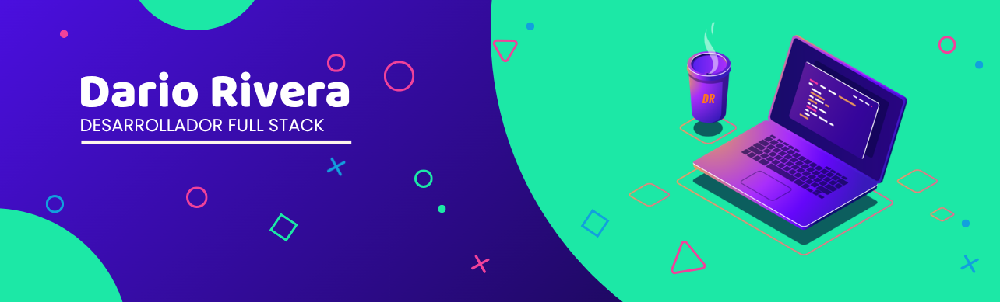

<!-- welcome message -->
<h2>Hola, ¿qué más? </h2>

## 🌍 Sobre mí
Soy Darío Sebastián Rivera Sáenz, de Tunja, Boyacá, Colombia. Me apasiona construir productos completos, desde el backend y las bases de datos hasta la experiencia móvil con Flutter — siempre buscando entender el ciclo completo de un producto, no solo una parte de él. 🚀

Últimamente me he metido de lleno en el mundo de la IA y la automatización, explorando LangChain, LangGraph y n8n — construyendo desde chatbots con integraciones de mensajería hasta flujos de trabajo automatizados.

<h1>Tecnologías conocidas👨🏻‍💻</h1>
<!--tech stack icons-->

<h3>Frontend & Mobile</h3>

<h3>Backend</h3>

<h3>Bases de datos</h3>

<h3>Automatización & IA</h3>

<h3>Herramientas</h3>

 

## 🤝 Conectemos
Si te interesa la tecnología, el desarrollo full stack, o simplemente quieres charlar sobre proyectos, ¡con gusto conectamos!

 

<picture>
  <source media="(prefers-color-scheme: dark)" srcset="https://raw.githubusercontent.com/DarioRiverah/DarioRiverah/output/github-contribution-grid-snake-dark.svg">
  <source media="(prefers-color-scheme: light)" srcset="https://raw.githubusercontent.com/DarioRiverah/DarioRiverah/output/github-contribution-grid-snake.svg">
  
</picture>

 

 

